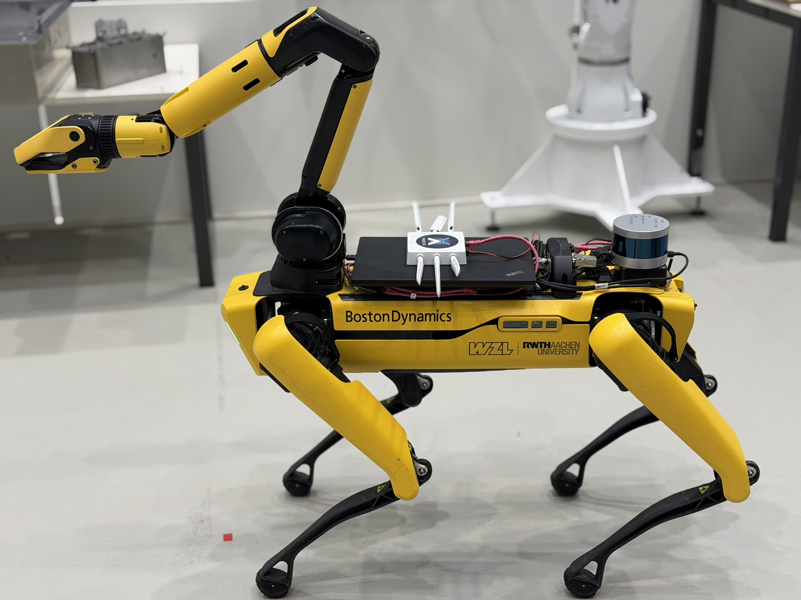

# About this Branch *devel*

This branch was created during development to support execution of the **Simulated Spot robot**.  
It contains largely the same structure and components as the **main** branch, with additional configurations and adaptations specifically required for **simulation using Webots**.

If you intend to run the system in simulation, make sure to **rebuild the relevant Docker images** as described in  
[3. Running the Demo – Quick Start](#3-running-the-demo--quick-start), so that the simulation-specific configurations are correctly applied.

Although this branch may also run on the **real robot**, it was **not validated on physical hardware**.  
Using this branch on the real system may therefore lead to **unintended or undefined behavior**.

For real-robot experiments, the **main** branch is the recommended and tested configuration.

# About this Repository

This repository was developed as part of the Master’s thesis of  
**[Ana Laura Soethe Chagas](https://github.com/alaurachagas)** at the  
**[Laboratory for Machine Tools and Production Engineering (WZL), RWTH Aachen University](https://www.wzl.rwth-aachen.de/go/id/sijq/?lidx=1)**.

**Thesis title:**  
*Embodied-AI Agent Integrated with a Quadruped Robot for Mapping & Navigation of Flexible Assembly Environments*

This repository contains the full implementation of an **Embodied-AI agent** (based on **Llama 3.1**) deployed on a **Boston Dynamics Spot** robot. The system was validated in two scenarios:
- **Simulation**, using **Webots**
- **Real-world deployment**, using Spot, a Velodyne LiDAR, and an edge-computing setup

This README describes the repository structure, its main components, and provides step-by-step instructions for running the system on either the real robot or in simulation.

---

## Table of Contents
[1. General Repository Organization](#1-general-repository-organization)  
[1.1 Submodules: Brief Overview](#11-submodules-brief-overview)  
[2. Prerequisites](#2-prerequisites)  
[2.1 Installing Dependencies](#21-installing-dependencies)  
[3. Running the Demo – Quick Start](#3-running-the-demo--quick-start)  
[3.1 Setting up the Real Robot](#31-setting-up-the-real-robot)  
[3.2 Setting up the Simulation](#32-setting-up-the-simulation)

---

# 1. General Repository Organization

This is a **master repository** that acts as a wrapper around multiple ROS 2–based submodules. The overall design goals of the framework are:

1. **Modularity**  
   Each subsystem (agent, navigation, SLAM, simulation, drivers) is developed and maintained independently using ROS 2 packages and Git submodules.

2. **Reproducibility**  
   Docker is used extensively to ensure that the same setup can be reproduced across machines with minimal configuration effort.

3. **Interoperability**  
   The system integrates standard robotics software (ROS 2 Humble, Nav2, Cartographer, Webots) and can be extended with minimal friction.

4. **Scalability**  
   New modules, sensors, or behaviors can be added without redesigning the overall system architecture.

### Repository Structure

The most relevant directories are:

- **colcon_ws/src/**  
  Contains all ROS 2 submodules. The structure follows the standard ROS workspace layout and is mirrored inside the Docker images.

- **Dockerfiles/**  
  Dockerfiles used to build the individual images required by the system.

- **docker_build/**  
  Bash scripts for building Docker images on Linux systems.

- **docker_run/**  
  Bash scripts for launching containers with the correct parameters and mounts.

- **entrypoint_scripts/**  
  Scripts executed automatically when containers start. These scripts launch the appropriate ROS 2 nodes and tools.

Additional configuration directories:

- **files_to_change/**  
  Modified versions of files originating from submodules. These are injected into Docker images to ensure compatibility with this repository.

- **map/**  
  Shared directory for Cartographer and Nav2, used to store and reuse generated maps.

- **config/**  
  RViz2 and visualization configuration files, primarily used by description and simulation containers.

- **webots_files/**  
  Simulation-specific configuration files and patches required by the Webots setup.

---

## 1.1 Submodules: Brief Overview

<picture>
  <source media="(prefers-color-scheme: dark)" srcset="images_readme/dark_Spot_agent_structure.svg">
  <source media="(prefers-color-scheme: light)" srcset="images_readme/light_Spot_agent_structure.svg">
  
</picture>

This repository uses **nine submodules** in total. The most important ones—developed or heavily adapted during the thesis—are:

- **ai_agent_spot**  
  The core Embodied-AI agent, implemented as a ROS 2 package using **LangChain v1.0.0** and **Llama 3.1**.  
  It interprets natural-language commands, selects tools, and orchestrates navigation and mapping actions.

- **cartographer_spot**  
  Configuration and launch files for running **Cartographer SLAM** with Spot, both in simulation and on real hardware.

- **spot_nav2**  
  Custom **Nav2** configuration tailored to the Spot robot, optimized for autonomous navigation in structured indoor environments.

### External Submodules

The following submodules were developed by external teams but were **essential for the thesis work**, enabling real-world deployment, perception, communication, and simulation fidelity:

- **velodyne**  
  Forked from the official ROS Velodyne driver. After the Humble branch was removed upstream, this repository was preserved privately.  
  It provides the primary LiDAR driver and publishes sensor data as `PointCloud2` messages.

- **point_cloud_transport** and **point_cloud_transport_plugins**  
  Used to efficiently encode and decode `PointCloud2` messages.  
  These packages significantly reduce network load and enable reliable wireless communication between the robot and the edge workstation.

- **velodyne_description** and **spot_description**  
  ROS 2 packages containing URDFs and mesh files required to visualize the Spot robot and Velodyne LiDAR in RViz2.

- **webots_ros2_spot**  
  A complete simulation setup for running Spot with a Velodyne LiDAR in **Webots**, enabling realistic testing without physical hardware.

---

# 2. Prerequisites

To run this repository, you need:

- **Linux** or **Windows with WSL2 (Ubuntu 22.04)**
- **Docker**

ROS 2 is **not required on the host system**, as all ROS components run inside Docker containers.

---

## 2.1 Installing Dependencies

This section is intended for users unfamiliar with the required tools.

### 2.1.1 WSL2 Ubuntu (Windows only)

This repository relies heavily on Bash scripts, which cannot be executed natively on Windows.

Windows users must install **WSL2 with Ubuntu 22.04** by following the official Ubuntu guide:  
https://documentation.ubuntu.com/wsl/stable/howto/install-ubuntu-wsl2/

### 2.1.2 Docker

Docker is the backbone of this repository, providing isolation, reproducibility, and modularity.

Install Docker by following the official documentation:  
https://docs.docker.com/engine/install/ubuntu/

---

# 3. Running the Demo – Quick Start

First, clone the repository **with submodules**:

```sh
git clone --recursive-submodules https://github.com/alaurachagas/spot_ros2.git
cd spot_ros2
```

## Build Docker Images

After cloning the repository, all required Docker images must be built before running the system.  
Depending on whether you are working with the **real robot**, **simulation**, or **both**, different images are required.

---

### Images required for **both real robot and simulation**

```sh
# Edge workstation and simulation PC
bash docker_build/docker_build_agent.sh
```

```sh
# Edge workstation and simulation PC
bash docker_build/docker_build_carto.sh
```

---

### Images required for **real robot only**

```sh
# Edge workstation
bash docker_build/docker_build_nav2.sh
```

```sh
# Laptop (connected directly to Spot)
bash docker_build/docker_build_spot.sh
```

```sh
# Laptop and edge workstation
bash docker_build/docker_build_velo.sh
```

```sh
# Edge workstation
bash docker_build/docker_build_description.sh
```

---

### Images required for **simulation only**

```sh
# Simulation PC
bash docker_build/docker_build_webots.sh
```

---

## 3.1 Setting up the Real Robot

### 3.1.1 Powering and Safety

Before operating the physical Spot robot, ensure that you are familiar with all **safety procedures** and operational constraints.

If you have not completed the required safety training, **do not operate the robot** and contact **Lucas Manassés** before proceeding.

Refer to the Spot driver documentation for detailed safety instructions and system behavior.  

---

### 3.1.2 Hardware and Network Setup

1. Assemble all hardware components on the robot as shown in the figure below.



2. Power on all devices and connect them to the laptop using Ethernet cables.
3. Verify connectivity via the following web interfaces:
   - Velodyne LiDAR: 192.168.0.186  
   - Spot robot: 192.168.50.3  
   - 5G modem: 192.168.1.1
4. In the Velodyne web interface, change the **rotation rate from 300 RPM to 600 RPM**.
5. Network configuration:
   - If using **5G**, disable Wi-Fi on the laptop.
   - If using **Wi-Fi 6**, connect to the `wifi6_2g` network.
6. Test network connectivity:
   - 5G: ```ping 192.168.20.21```  
   - Wi-Fi 6: ```ping 192.168.10.21```
7. Start the **Zenoh router** (see the [RMW Zenoh](https://git-ce.rwth-aachen.de/wzl-mq-ms/docker-ros/ros2/rmw_zenoh) repository).
8. Close the laptop lid once all checks are complete.

---

### 3.1.3 Initializing Containers on the Edge Workstation

This process requires **nine terminal windows**.

1. Power on the edge workstation.
2. Connect it to the appropriate network (5G or Wi-Fi 6).
3. Test connectivity to the laptop:
   - 5G: ```ping 172.16.35.6```  
   - Wi-Fi 6: ```ping 192.168.10.135```
4. Open a terminal in the root directory of this repository.
5. Start the **Zenoh router** (*Terminal 1*).
6. Launch all drivers (*Terminal 2*):

```sh
bash docker_run/docker_run_all_driver.sh
```

7. Start Cartographer (*Terminal 3*):

```sh
bash docker_run/docker_run_cartographer.sh
```

8. Start the Time Normalizer (*Terminal 4*):

```sh
bash docker_run/docker_run_point_time.sh
```

9. Start Nav2 (*Terminal 5*):

```sh
bash docker_run/docker_run_nav2.sh
```

10. Launch RViz2 (*Terminal 6*):

```sh
bash docker_run/docker_run_description.sh
```

11. Stop any locally running Ollama instance:

```sh
sudo systemctl stop ollama
```

12. Launch the LLM (*Terminal 7*):

```sh
bash docker_run/docker_run_llm.sh
```

13. Launch the AI agent (*Terminal 8*):

```sh
bash docker_run/docker_run_agent.sh
```

14. Commands are sent to the agent by publishing messages to the `/transcription_text` topic (*Terminal 9*):

```sh
ros2 topic pub -1 /transcription_text std_msgs/msg/String "data: <ADD MESSAGE HERE>"
```

---

## 3.2 Setting up the Simulation


The simulation setup follows the same high-level pipeline as the real-robot deployment, but replaces all hardware-specific drivers with a **Webots-based simulation** of the Spot robot.

The Embodied-AI agent, SLAM, and navigation logic remain unchanged, enabling realistic end-to-end testing without physical hardware.

---

### 3.2.1 Launching the Simulation Environment

1. Open a terminal in the root directory of this repository.
2. Start the Webots simulation:

```sh
bash docker_run/docker_run_webots.sh
```

This command launches:
- The Webots simulator
- A simulated Spot robot
- A simulated Velodyne LiDAR
- The required ROS 2 bridges for sensor data and control

Wait until the simulation is fully loaded before proceeding.

---

### 3.2.2 Mapping with Cartographer

Once the simulation is running, start the SLAM module using Cartographer.

```sh
bash docker_run/docker_run_cartographer.sh
```

At this stage:
- The robot can be teleoperated or commanded to move
- Cartographer builds a map online using simulated LiDAR data
- Localization is handled internally by Cartographer during mapping

After completing the mapping process, the map must be saved for later use by the navigation stack.

To save the generated map, use:

```sh
bash docker_run/docker_run_save_map.sh
```

The saved map will be stored in the shared `map/` directory.

---

### 3.2.3 Running the Navigation Stack

Navigation in simulation is currently based on **Nav2 with AMCL**.

To start the navigation stack:

```sh
bash docker_run/docker_run_sim_nav2.sh
```

Before launching Nav2, ensure that:
1. A map has been created using Cartographer
2. The map has been saved using `docker_run_save_map.sh`
3. The Nav2 configuration file is updated to reference the correct map file
4. The Cartographer container is stopped

---

### 3.2.4 Launching the Spot Agent

1. Stop any locally running Ollama instance:

```sh
sudo systemctl stop ollama
```

2. Launch the LLM:

```sh
bash docker_run/docker_run_llm.sh
```

3. Launch the AI agent:

```sh
bash docker_run/docker_run_agent.sh
```

4. Commands are sent to the agent by publishing messages to the `/transcription_text` topic:

```sh
ros2 topic pub -1 /transcription_text std_msgs/msg/String "data: <ADD MESSAGE HERE>"
```

---

### 3.2.5 Current Limitations

The simulation pipeline is functional but has the following known limitations:

- **Nav2 currently relies on AMCL for localization**, not Cartographer.
- While Cartographer can be used for both mapping and localization in Webots, direct integration of Cartographer-based localization into Nav2 is still a work in progress.
- Switching between mapping and navigation requires manual steps (map saving, configuration update, and module restart).

These limitations do not affect mapping quality or agent behavior, but they impose additional setup steps when transitioning from SLAM to navigation.

---

Despite these limitations, the simulation environment provides a reliable and reproducible platform for developing, testing, and validating the Embodied-AI agent and its interaction with navigation and mapping modules.
